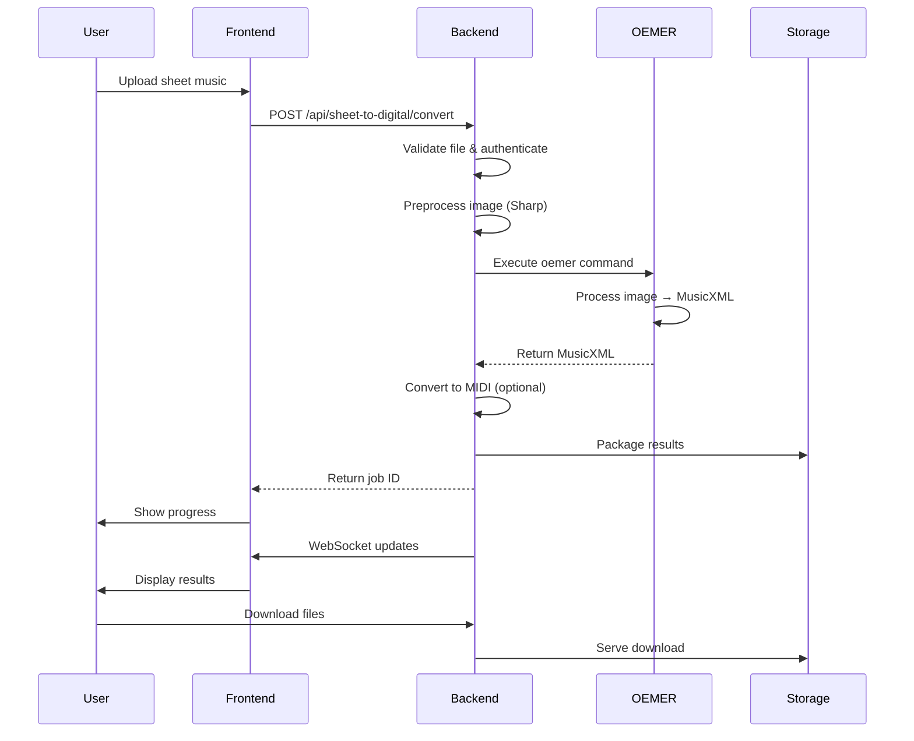

# Ensemble Architecture Documentation

This document provides a comprehensive overview of Ensemble's architecture, focusing on the new OEMER service implementation and system design.

## 📋 Table of Contents

- [Overview](#overview)
- [System Architecture](#system-architecture)
- [Frontend Architecture](#frontend-architecture)
- [Backend Architecture](#backend-architecture)
- [OEMER Service Architecture](#oemer-service-architecture)
- [Data Flow](#data-flow)
- [Component Interactions](#component-interactions)
- [Design Patterns](#design-patterns)
- [Scalability Considerations](#scalability-considerations)
- [Security Architecture](#security-architecture)
- [Performance Optimization](#performance-optimization)
- [Monitoring and Observability](#monitoring-and-observability)

## 🚀 Overview

Ensemble is a full-stack web application that converts traditional sheet music into digital formats using AI-powered optical music recognition. The system consists of:

- **Frontend**: Modern React/Next.js web application
- **Backend**: Node.js/Express API with OEMER integration
- **OEMER Service**: Advanced optical music recognition engine
- **Authentication**: Clerk-based user management
- **File Processing**: Image preprocessing and format conversion

### Key Architectural Improvements

1. **Simplified OEMER Integration**: Replaced complex Python script generation with direct command-line execution
2. **Enhanced Error Handling**: Comprehensive error handling and logging throughout the system
3. **Improved Image Processing**: Sharp-based preprocessing for better OCR results
4. **Better Performance**: Optimized timeouts and resource management
5. **Production Ready**: Enhanced monitoring and observability

## 🏗️ System Architecture

### High-Level Architecture

```
┌─────────────────────────────────────────────────────────────┐
│                     User Interface                          │
│  ┌─────────────┐  ┌─────────────┐  ┌─────────────┐         │
│  │   Web App   │  │   Mobile    │  │   Desktop   │         │
│  │  (Next.js)  │  │   App       │  │   Client    │         │
│  └─────────────┘  └─────────────┘  └─────────────┘         │
└─────────────────────────────────────────────────────────────┘
                              │
                              ▼
┌─────────────────────────────────────────────────────────────┐
│                     Load Balancer                           │
│  ┌─────────────────────────────────────────────────────────┐ │
│  │                 CDN & SSL Termination                  │ │
│  └─────────────────────────────────────────────────────────┘ │
└─────────────────────────────────────────────────────────────┘
                              │
                              ▼
┌─────────────────────────────────────────────────────────────┐
│                   Frontend Service                          │
│  ┌─────────────┐  ┌─────────────┐  ┌─────────────┐         │
│  │   Next.js   │  │   Static    │  │   API       │         │
│  │   App       │  │   Assets    │  │   Gateway   │         │
│  └─────────────┘  └─────────────┘  └─────────────┘         │
└─────────────────────────────────────────────────────────────┘
                              │
                              ▼
┌─────────────────────────────────────────────────────────────┐
│                   Backend Service                           │
│  ┌─────────────┐  ┌─────────────┐  ┌─────────────┐         │
│  │   Express   │  │   File      │  │   OEMER     │         │
│  │   API       │  │   Storage   │  │   Service   │         │
│  └─────────────┘  └─────────────┘  └─────────────┘         │
│  ┌─────────────┐  ┌─────────────┐  ┌─────────────┐         │
│  │   Auth      │  │   Logging   │  │   Database  │         │
│  │   Service   │  │   System    │  │   (Optional)│         │
│  └─────────────┘  └─────────────┘  └─────────────┘         │
└─────────────────────────────────────────────────────────────┘
                              │
                              ▼
┌─────────────────────────────────────────────────────────────┐
│                   External Services                         │
│  ┌─────────────┐  ┌─────────────┐  ┌─────────────┐         │
│  │   Clerk     │  │   OEMER     │  │   Storage   │         │
│  │   Auth      │  │   Engine    │  │   Service   │         │
│  └─────────────┘  └─────────────┘  └─────────────┘         │
└─────────────────────────────────────────────────────────────┘
```

### Component Responsibilities

| Component | Responsibility |
|-----------|----------------|
| **Frontend** | User interface, file upload, results display |
| **Backend API** | Request handling, authentication, orchestration |
| **OEMER Service** | Optical music recognition and MusicXML generation |
| **File Storage** | Temporary file handling and result packaging |
| **Authentication** | User management and access control |
| **Logging** | System monitoring and debugging |

## 🎨 Frontend Architecture

### Technology Stack

- **Next.js 15**: React framework with App Router
- **TypeScript**: Type-safe development
- **Tailwind CSS**: Utility-first styling
- **Clerk**: Authentication and user management
- **Radix UI**: Accessible component library

### Component Structure

```
frontend/
├── app/                    # Next.js App Router
│   ├── components/         # Page-specific components
│   ├── services/           # Service pages
│   ├── about/              # Static pages
│   ├── dashboard/          # User dashboard
│   ├── globals.css         # Global styles
│   ├── layout.tsx          # Root layout
│   └── page.tsx            # Home page
├── components/            # Reusable components
│   ├── ui/                # UI component library
│   ├── footer.tsx         # Footer component
│   ├── header.tsx         # Header component
│   └── theme-provider.tsx # Theme provider
└── lib/                   # Shared utilities
    ├── api-config.ts      # API configuration
    ├── clerk-config.ts    # Clerk configuration
    └── utils.ts           # Utility functions
```

### State Management

```typescript
// Global state using React Context
const AppContext = createContext<AppContextType>({
  user: null,
  isAuthenticated: false,
  conversionJobs: [],
  setConversionJobs: () => {},
});

// Component-level state using hooks
const [uploadProgress, setUploadProgress] = useState(0);
const [conversionStatus, setConversionStatus] = useState('idle');
const [results, setResults] = useState<ConversionResult | null>(null);
```

### Data Flow in Frontend

1. **User Authentication**: Clerk handles user login/registration
2. **File Upload**: User selects sheet music image
3. **Progress Tracking**: Real-time progress updates
4. **Results Display**: Show conversion results and downloads
5. **Error Handling**: Display user-friendly error messages

## 🔧 Backend Architecture

### Technology Stack

- **Node.js 18+**: Runtime environment
- **Express.js**: Web framework
- **Winston**: Structured logging
- **Multer**: File upload handling
- **Sharp**: Image processing
- **xml2js**: XML parsing

### Service Architecture

```
backend/
├── routes/                # API endpoints
│   └── sheet-to-digital.js # Conversion endpoints
├── services/              # Business logic
│   ├── oemer-service.js   # OEMER integration
│   └── midi-converter.js  # MIDI conversion
├── middleware/            # Express middleware
│   ├── auth.js           # Authentication
│   └── validation.js     # Input validation
├── utils/                 # Utilities
│   ├── logger.js         # Logging configuration
│   └── setup.js          # Setup utilities
├── logs/                  # Log files
├── temp/                  # Temporary files
├── downloads/             # Download files
└── server.js              # Main server file
```

### API Layer Design

```javascript
// Route definition with middleware
router.post('/convert', 
  authenticateUser,           // Authentication check
  validateConversionRequest,  // Input validation
  rateLimiter,               // Rate limiting
  sheetToDigitalController.convert
);

// Controller with business logic
const convert = async (req, res) => {
  try {
    const { file, filename, options } = req.body;
    const userId = req.user.id;
    
    // Create conversion job
    const job = await jobService.createJob(userId, filename);
    
    // Process file asynchronously
    processFile(file, job.id, options);
    
    // Return job ID for tracking
    res.json({ success: true, job_id: job.id });
  } catch (error) {
    logger.error('Conversion failed:', error);
    res.status(500).json({ error: 'Conversion failed' });
  }
};
```

### Service Layer Architecture

```javascript
// Service layer for business logic
class ConversionService {
  async convertSheetMusic(file, options) {
    try {
      // Preprocess image
      const processedImage = await this.preprocessImage(file);
      
      // Convert with OEMER
      const musicXml = await this.oemerService.processImage(
        processedImage, 
        options
      );
      
      // Convert to MIDI if requested
      let midi = null;
      if (options.convertToMidi) {
        midi = await this.midiConverter.convert(musicXml);
      }
      
      // Package results
      return this.packageResults(musicXml, midi);
    } catch (error) {
      logger.error('Conversion service error:', error);
      throw error;
    }
  }
}
```

## 🎼 OEMER Service Architecture

### Architecture Overview

The OEMER service has been completely redesigned to use direct command-line execution instead of complex Python script generation.

### Key Improvements

1. **Direct CLI Execution**: Uses `oemer` command directly
2. **Enhanced Image Processing**: Sharp-based preprocessing
3. **Better Error Handling**: Comprehensive timeout and error management
4. **Detailed Logging**: Step-by-step processing logs
5. **Model Verification**: Automatic model file checking

### Service Components

```javascript
class OemerService {
  constructor() {
    this.oemerCommand = 'oemer';
    this.maxProcessingTime = 30 * 60 * 1000; // 30 minutes
    this.initialize();
  }

  async initialize() {
    // Check OEMER installation
    await this.checkInstallation();
    
    // Verify model files
    await this.verifyModels();
  }

  async processImage(imagePath, outputDir) {
    const startTime = Date.now();
    
    try {
      // Preprocess image for better recognition
      const preprocessedPath = await this.preprocessImage(imagePath, outputDir);
      
      // Execute OEMER directly
      const oemerResult = await this.runOemer(preprocessedPath, outputDir);
      
      // Process results
      const result = await this.processOemerOutput(oemerResult, outputDir, startTime);
      
      return result;
    } catch (error) {
      logger.error('OEMER processing failed:', error);
      throw error;
    }
  }
}
```

### Image Processing Pipeline

```javascript
async preprocessImage(imagePath, outputDir) {
  try {
    logger.info('🖼️  Preprocessing image for optimal recognition...');
    
    const sharp = require('sharp');
    const inputFileName = path.parse(imagePath).name;
    const outputPath = path.join(outputDir, `enhanced_${inputFileName}.png`);

    // Apply OEMER-optimized preprocessing
    await sharp(imagePath)
      .resize(
        Math.max(metadata.width * 1.5, 1800), // Ensure minimum width
        null,
        {
          withoutEnlargement: false,
          kernel: sharp.kernel.lanczos3
        }
      )
      .greyscale() // Convert to grayscale
      .normalize() // Normalize contrast
      .sharpen({ sigma: 1.2, m1: 0.7, m2: 2.5 }) // Enhance edges
      .png({ 
        quality: 100,
        compressionLevel: 0 // No compression
      })
      .toFile(outputPath);

    return outputPath;
  } catch (error) {
    logger.warn('Image preprocessing failed, using original:', error.message);
    return imagePath;
  }
}
```

### OEMER Execution

```javascript
async runOemer(imagePath, outputDir) {
  logger.info('🚀 Executing OEMER...');
  
  try {
    // Construct OEMER command
    const outputPath = path.join(outputDir, 'oemer_output.xml');
    const command = `${this.oemerCommand}`;
    const args = [
      imagePath,
      '--output-path', outputPath,
      '--without-deskew' // Skip deskewing since we preprocessed
    ];

    // Execute OEMER with timeout
    const result = await this.executeCommandWithTimeout(
      command, 
      args, 
      {
        timeout: this.maxProcessingTime,
        cwd: outputDir
      }
    );

    return {
      success: true,
      outputPath: outputPath,
      stdout: result.stdout,
      stderr: result.stderr,
      executionTime: result.executionTime
    };

  } catch (error) {
    logger.error('OEMER execution failed:', error);
    throw error;
  }
}
```

## 🔄 Data Flow

### Complete Conversion Pipeline

1. **User Upload**: User uploads sheet music image through frontend
2. **Authentication**: Clerk validates user session
3. **File Processing**: Backend receives and validates file
4. **Image Preprocessing**: Sharp enhances image quality
5. **OEMER Processing**: Optical music recognition generates MusicXML
6. **MIDI Conversion**: Optional MIDI generation from MusicXML
7. **Result Packaging**: Files are packaged for download
8. **User Notification**: User receives completion notification

### Sequence Diagram



## 🔗 Component Interactions

### Authentication Flow

```javascript
// Clerk authentication middleware
const authenticateUser = async (req, res, next) => {
  try {
    const { userId } = req.auth;
    
    if (!userId) {
      return res.status(401).json({ error: 'Authentication required' });
    }
    
    // Add user to request for downstream processing
    req.user = await clerk.users.getUser(userId);
    next();
  } catch (error) {
    logger.error('Authentication failed:', error);
    res.status(401).json({ error: 'Authentication failed' });
  }
};
```

### File Processing Flow

```javascript
// File processing orchestration
const processFile = async (fileData, jobId, options) => {
  try {
    // Save uploaded file
    const filePath = await fileService.saveFile(fileData, jobId);
    
    // Process with OEMER
    const result = await oemerService.processImage(
      filePath, 
      getJobDirectory(jobId),
      options
    );
    
    // Update job status
    await jobService.updateJob(jobId, {
      status: 'completed',
      result: result,
      completedAt: new Date()
    });
    
    // Notify user
    notificationService.notifyUser(jobId, 'completed');
    
  } catch (error) {
    logger.error('File processing failed:', error);
    
    // Update job status
    await jobService.updateJob(jobId, {
      status: 'failed',
      error: error.message,
      completedAt: new Date()
    });
    
    // Notify user
    notificationService.notifyUser(jobId, 'failed');
  }
};
```

## 📐 Design Patterns

### 1. Service Layer Pattern

```javascript
// Service layer for business logic
class SheetMusicService {
  constructor(oemerService, midiConverter, fileService) {
    this.oemerService = oemerService;
    this.midiConverter = midiConverter;
    this.fileService = fileService;
  }

  async convertSheetMusic(file, options) {
    // Business logic coordination
    const processedFile = await this.fileService.preprocess(file);
    const musicXml = await this.oemerService.process(processedFile);
    const midi = options.convertToMidi 
      ? await this.midiConverter.convert(musicXml) 
      : null;
    
    return this.packageResults(musicXml, midi);
  }
}
```

### 2. Strategy Pattern

```javascript
// Different processing strategies
class ProcessingStrategy {
  async process(imagePath) {
    throw new Error('Process method must be implemented');
  }
}

class OemerStrategy extends ProcessingStrategy {
  async process(imagePath) {
    return await oemerService.processImage(imagePath);
  }
}

class MockStrategy extends ProcessingStrategy {
  async process(imagePath) {
    // Return mock data for development
    return { success: true, mock: true };
  }
}

// Strategy selection
const strategy = process.env.NODE_ENV === 'production' 
  ? new OemerStrategy() 
  : new MockStrategy();
```

### 3. Observer Pattern

```javascript
// Job status observer
class JobObserver {
  constructor() {
    this.observers = [];
  }

  subscribe(callback) {
    this.observers.push(callback);
  }

  notify(jobId, status) {
    this.observers.forEach(callback => {
      callback(jobId, status);
    });
  }
}

// Usage
const jobObserver = new JobObserver();

// WebSocket notification
jobObserver.subscribe((jobId, status) => {
  io.to(`job_${jobId}`).emit('status_update', { jobId, status });
});

// Email notification
jobObserver.subscribe((jobId, status) => {
  if (status === 'completed') {
    emailService.sendCompletionEmail(jobId);
  }
});
```

### 4. Factory Pattern

```javascript
// File processor factory
class FileProcessorFactory {
  static createProcessor(fileType) {
    switch (fileType) {
      case 'image':
        return new ImageProcessor();
      case 'musicxml':
        return new MusicXmlProcessor();
      case 'midi':
        return new MidiProcessor();
      default:
        throw new Error(`Unsupported file type: ${fileType}`);
    }
  }
}

// Usage
const processor = FileProcessorFactory.createProcessor('image');
const result = await processor.process(file);
```

## 📈 Scalability Considerations

### Horizontal Scaling

1. **Stateless Services**: Backend services are stateless for easy scaling
2. **Load Balancing**: Multiple backend instances behind load balancer
3. **Database**: Use managed database services for automatic scaling
4. **File Storage**: Use cloud storage (S3, etc.) for scalable file handling

### Vertical Scaling

1. **Resource Limits**: Configure appropriate CPU/memory limits
2. **Connection Pooling**: Database connection pooling
3. **Caching**: Redis for session and result caching
4. **Compression**: Gzip/Brotli for response compression

### Caching Strategy

```javascript
// Redis caching for frequent operations
class CacheService {
  constructor(redisClient) {
    this.redis = redisClient;
  }

  async getConversionResults(jobId) {
    const cacheKey = `conversion:${jobId}`;
    const cached = await this.redis.get(cacheKey);
    
    if (cached) {
      return JSON.parse(cached);
    }
    
    return null;
  }

  async cacheConversionResults(jobId, results) {
    const cacheKey = `conversion:${jobId}`;
    await this.redis.setex(
      cacheKey, 
      3600, // 1 hour TTL
      JSON.stringify(results)
    );
  }
}
```

## 🔒 Security Architecture

### Authentication & Authorization

```javascript
// Clerk-based authentication
const authMiddleware = async (req, res, next) => {
  try {
    const token = req.headers.authorization?.replace('Bearer ', '');
    
    if (!token) {
      return res.status(401).json({ error: 'No token provided' });
    }
    
    const session = await clerk.sessions.verifyToken(token);
    
    if (!session) {
      return res.status(401).json({ error: 'Invalid token' });
    }
    
    req.user = session.user;
    next();
  } catch (error) {
    logger.error('Authentication error:', error);
    res.status(401).json({ error: 'Authentication failed' });
  }
};
```

### Input Validation

```javascript
// Comprehensive input validation
const validateConversionRequest = (req, res, next) => {
  const schema = Joi.object({
    file: Joi.string().base64().required(),
    filename: Joi.string().pattern(/\.(png|jpg|jpeg|tiff|bmp)$/i).required(),
    options: Joi.object({
      convertToMidi: Joi.boolean().default(false),
      enhanceImage: Joi.boolean().default(true),
      timeout: Joi.number().min(10000).max(3600000).default(1800000)
    })
  });

  const { error } = schema.validate(req.body);
  
  if (error) {
    return res.status(400).json({ 
      error: 'Invalid request',
      details: error.details 
    });
  }
  
  next();
};
```

### File Security

```javascript
// Secure file handling
class FileSecurityService {
  async validateFile(fileData, filename) {
    // Check file size
    if (fileData.length > MAX_FILE_SIZE) {
      throw new Error('File too large');
    }
    
    // Check file extension
    const allowedExtensions = ['.png', '.jpg', '.jpeg', '.tiff', '.bmp'];
    const extension = path.extname(filename).toLowerCase();
    
    if (!allowedExtensions.includes(extension)) {
      throw new Error('Unsupported file format');
    }
    
    // Validate file content (basic check)
    if (!fileData.startsWith(this.getFileSignature(extension))) {
      throw new Error('Invalid file content');
    }
    
    return true;
  }
}
```

## ⚡ Performance Optimization

### Image Processing Optimization

```javascript
// Optimized image processing pipeline
class ImageProcessingService {
  async optimizeImage(imagePath) {
    const startTime = Date.now();
    
    try {
      // Use Sharp for high-performance processing
      const pipeline = sharp(imagePath);
      
      // Get image metadata first
      const metadata = await pipeline.metadata();
      
      // Apply optimizations based on image characteristics
      const optimized = pipeline
        .resize(
          Math.min(metadata.width * 1.5, 2000),
          Math.min(metadata.height * 1.5, 2000),
          { fit: 'inside', withoutEnlargement: true }
        )
        .modulate({ brightness: 1.1, saturation: 1.1 })
        .sharpen()
        .png({ quality: 100, compressionLevel: 0 });
      
      const outputPath = this.getOptimizedPath(imagePath);
      await optimized.toFile(outputPath);
      
      logger.info(`Image optimized in ${Date.now() - startTime}ms`);
      return outputPath;
      
    } catch (error) {
      logger.error('Image optimization failed:', error);
      throw error;
    }
  }
}
```

### Database Optimization

```javascript
// Database query optimization
class JobRepository {
  async getRecentJobs(userId, limit = 10) {
    return await prisma.job.findMany({
      where: { userId },
      orderBy: { createdAt: 'desc' },
      take: limit,
      select: {
        id: true,
        filename: true,
        status: true,
        createdAt: true,
        completedAt: true
      }
    });
  }

  async getJobWithResults(jobId) {
    return await prisma.job.findUnique({
      where: { id: jobId },
      include: {
        results: {
          select: {
            musicXmlPath: true,
            midiPath: true,
            confidence: true,
            processingTime: true
          }
        }
      }
    });
  }
}
```

### Memory Management

```javascript
// Memory-efficient file processing
class MemoryEfficientProcessor {
  async processLargeFile(fileStream) {
    return new Promise((resolve, reject) => {
      const chunks = [];
      let totalSize = 0;
      
      fileStream.on('data', (chunk) => {
        chunks.push(chunk);
        totalSize += chunk.length;
        
        // Prevent memory issues
        if (totalSize > MAX_MEMORY_SIZE) {
          reject(new Error('File too large for memory processing'));
          return;
        }
      });
      
      fileStream.on('end', () => {
        const buffer = Buffer.concat(chunks);
        resolve(buffer);
      });
      
      fileStream.on('error', reject);
    });
  }
}
```

## 📊 Monitoring and Observability

### Logging Architecture

```javascript
// Structured logging with Winston
const logger = winston.createLogger({
  level: process.env.LOG_LEVEL || 'info',
  format: winston.format.combine(
    winston.format.timestamp(),
    winston.format.errors({ stack: true }),
    winston.format.json()
  ),
  defaultMeta: { service: 'ensemble-backend' },
  transports: [
    new winston.transports.File({ 
      filename: 'logs/error.log', 
      level: 'error' 
    }),
    new winston.transports.File({ 
      filename: 'logs/combined.log' 
    })
  ]
});

// Console transport for development
if (process.env.NODE_ENV !== 'production') {
  logger.add(new winston.transports.Console({
    format: winston.format.simple()
  }));
}
```

### Health Checks

```javascript
// Comprehensive health check
const healthCheck = async (req, res) => {
  try {
    const checks = {
      database: await checkDatabase(),
      oemer: await checkOemer(),
      storage: await checkStorage(),
      memory: checkMemoryUsage(),
      disk: checkDiskSpace()
    };
    
    const isHealthy = Object.values(checks).every(check => check.healthy);
    
    res.status(isHealthy ? 200 : 503).json({
      status: isHealthy ? 'healthy' : 'unhealthy',
      timestamp: new Date().toISOString(),
      checks,
      version: process.env.npm_package_version
    });
    
  } catch (error) {
    logger.error('Health check failed:', error);
    res.status(503).json({
      status: 'unhealthy',
      error: error.message,
      timestamp: new Date().toISOString()
    });
  }
};
```

### Metrics Collection

```javascript
// Application metrics
class MetricsService {
  constructor() {
    this.counters = new Map();
    this.gauges = new Map();
  }

  incrementCounter(name, value = 1, tags = {}) {
    const key = this.getKey(name, tags);
    const current = this.counters.get(key) || 0;
    this.counters.set(key, current + value);
  }

  setGauge(name, value, tags = {}) {
    const key = this.getKey(name, tags);
    this.gauges.set(key, value);
  }

  getMetrics() {
    return {
      counters: Object.fromEntries(this.counters),
      gauges: Object.fromEntries(this.gauges)
    };
  }

  // Example usage
  trackConversion(jobId, success, processingTime) {
    this.incrementCounter('conversion.attempted');
    
    if (success) {
      this.incrementCounter('conversion.successful');
      this.setGauge('conversion.time', processingTime);
    } else {
      this.incrementCounter('conversion.failed');
    }
  }
}
```

### Performance Monitoring

```javascript
// Performance monitoring middleware
const performanceMonitor = (req, res, next) => {
  const start = Date.now();
  
  res.on('finish', () => {
    const duration = Date.now() - start;
    const memoryUsage = process.memoryUsage();
    
    // Log performance metrics
    logger.info('Request completed', {
      method: req.method,
      url: req.url,
      statusCode: res.statusCode,
      duration,
      memory: {
        rss: Math.round(memoryUsage.rss / 1024 / 1024), // MB
        heapTotal: Math.round(memoryUsage.heapTotal / 1024 / 1024), // MB
        heapUsed: Math.round(memoryUsage.heapUsed / 1024 / 1024), // MB
        external: Math.round(memoryUsage.external / 1024 / 1024) // MB
      }
    });
    
    // Track metrics
    metrics.incrementCounter('request.total');
    metrics.setGauge('request.duration', duration);
    metrics.setGauge('request.memory', memoryUsage.heapUsed / 1024 / 1024);
  });
  
  next();
};
```

---

**Architecture Documentation Complete** 🎯

This comprehensive architecture documentation covers all aspects of the Ensemble system, with special focus on the new OEMER service implementation. The architecture is designed to be scalable, secure, and maintainable while providing excellent performance for sheet music conversion tasks.

*For additional questions or clarifications about the architecture, please refer to the other documentation files or contact the development team.*
